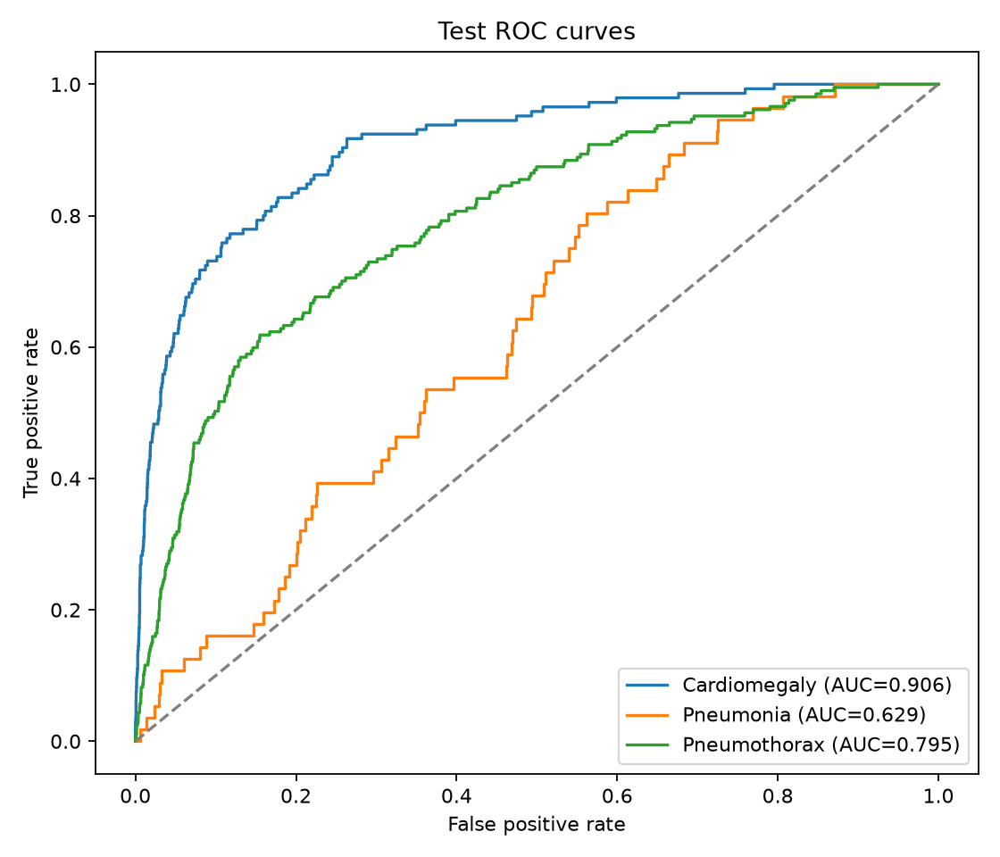
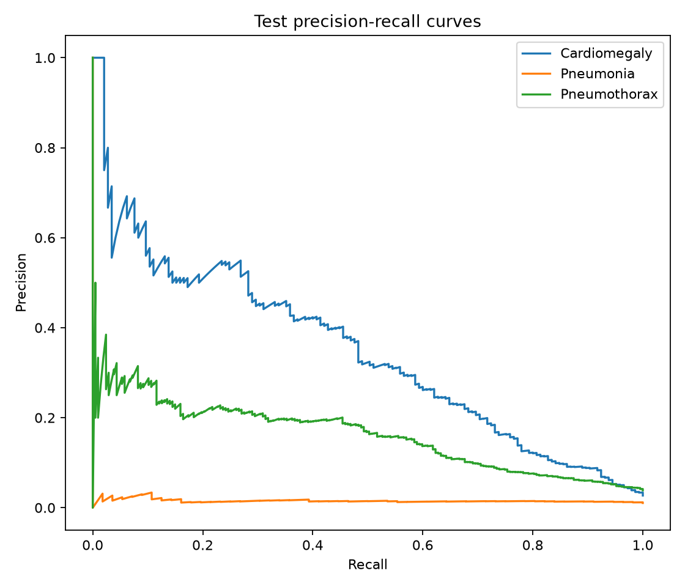
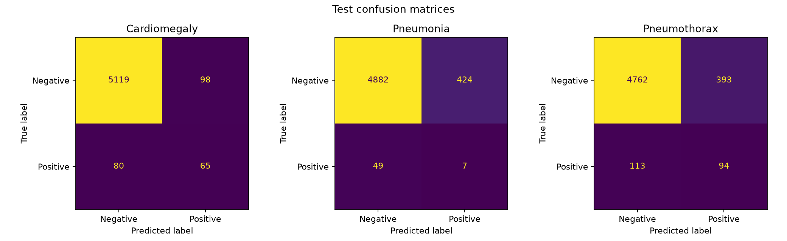

# LungAI Diagnostics

LungAI Diagnostics is a reproducible PyTorch research prototype for multi-label classification of three thoracic findings from chest X-rays: cardiomegaly, pneumonia, and pneumothorax.

> **Medical disclaimer:** This project is for education, research, and software-engineering demonstration only. It is not a medical device, has not been clinically validated, and must not be used for diagnosis, triage, treatment, or patient-care decisions.

## Project objective

The project demonstrates an end-to-end machine-learning workflow: dataset preparation, transfer learning, class-imbalance handling, validation-based decision-threshold selection, held-out test evaluation, visual reporting, and automated checks.

## Dataset and split strategy

The pipeline expects CSV files containing a `path` column and one binary column per disease. Training, validation, and test data are kept separate:

- Training data fits the model.
- Validation data selects one F1-maximizing threshold per disease.
- Test data is used only for final reporting after thresholds are locked.

The model-ready development splits live under `data/processed/dev/`. Raw images and generated patient-level data are not committed to Git.

## Model architecture

The classifier is a DenseNet121 initialized with ImageNet weights. Its final layer is replaced with three logits, one per disease. Sigmoid converts logits into independent probabilities, allowing more than one finding per image.

## Training process

Images are resized to 224 × 224 and normalized with ImageNet statistics. Training augmentation includes random horizontal flips and small rotations. The model uses AdamW and binary cross-entropy with per-label positive-class weights to address class imbalance. The checkpoint with the lowest validation loss is saved as `artifacts/models/best_model.pt`.

## Validation threshold tuning

A single threshold of 0.5 is often unsuitable for imbalanced disease labels. The tuner searches 0.05–0.95 in 0.01 increments on validation data and maximizes F1 independently for each label.

| Disease | Locked threshold | Validation precision | Validation recall | Validation F1 | Validation AUROC |
|---|---:|---:|---:|---:|---:|
| Cardiomegaly | 0.89 | 0.347 | 0.509 | 0.413 | 0.923 |
| Pneumonia | 0.68 | 0.040 | 0.183 | 0.065 | 0.673 |
| Pneumothorax | 0.81 | 0.210 | 0.438 | 0.284 | 0.821 |

These are validation results, not final test claims.

## Final test metrics

The locked validation thresholds were applied once to the model-ready test split. Full machine-readable results are available in [`artifacts/metrics/final_test_evaluation.json`](artifacts/metrics/final_test_evaluation.json).

| Disease | Threshold | Precision | Recall | F1 | AUROC | Positive support |
|---|---:|---:|---:|---:|---:|---:|
| Cardiomegaly | 0.89 | 0.399 | 0.448 | 0.422 | 0.906 | 145 |
| Pneumonia | 0.68 | 0.016 | 0.125 | 0.029 | 0.629 | 56 |
| Pneumothorax | 0.81 | 0.193 | 0.454 | 0.271 | 0.795 | 207 |

Cardiomegaly shows strong ranking performance, while pneumothorax is moderate. Pneumonia remains weak; its result is reported transparently and is a central limitation of this baseline.

## Installation

```bash
git clone https://github.com/vanshviggg/lungai-diagnostics.git
cd lungai-diagnostics
python3 -m venv .venv
source .venv/bin/activate
pip install -r requirements.txt
```

## Usage

Train a model:

```bash
PYTHONPATH=src python -m lungai.training.train \
  --train-csv data/processed/dev/train.csv \
  --val-csv data/processed/dev/val.csv
```

Tune thresholds on validation data:

```bash
PYTHONPATH=src python -m lungai.evaluation.tune_thresholds \
  --val-csv data/processed/dev/val.csv \
  --checkpoint artifacts/models/best_model.pt
```

Run the final test evaluation with locked thresholds:

```bash
PYTHONPATH=src python -m lungai.evaluation.evaluate \
  --test-csv data/processed/dev/test.csv \
  --checkpoint artifacts/models/best_model.pt \
  --thresholds-json artifacts/metrics/thresholds.json
```

Run automated checks:

```bash
python -m pytest
```

## Generated visual results

### ROC curves



### Precision-recall curves



### Per-disease confusion matrices



## Repository structure

```text
src/lungai/
├── config.py
├── data/
│   ├── dataset.py
│   └── transforms.py
├── evaluation/
│   ├── evaluate.py
│   └── tune_thresholds.py
├── inference/
├── models/
│   └── chest_xray_model.py
└── training/
    └── train.py
tests/
artifacts/
requirements.txt
pyproject.toml
```

## Limitations

- Performance is dataset-specific and may not generalize to other hospitals, devices, populations, or imaging protocols.
- Severe class imbalance makes precision and F1 especially weak for pneumonia.
- Labels derived from reports may contain noise and are not equivalent to adjudicated clinical diagnoses.
- Thresholds optimize validation F1, which may not match a real clinical operating objective.
- No external validation, calibration study, fairness audit, prospective study, or regulatory review has been performed.
- Predictions should never be interpreted without qualified clinical oversight.

## License

See `LICENSE`.
